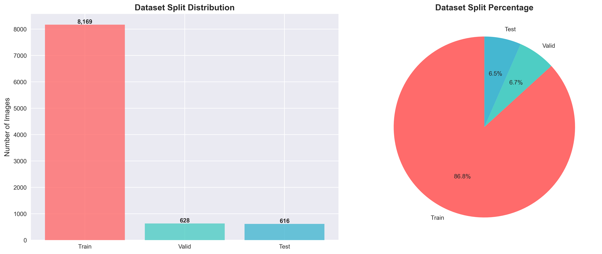
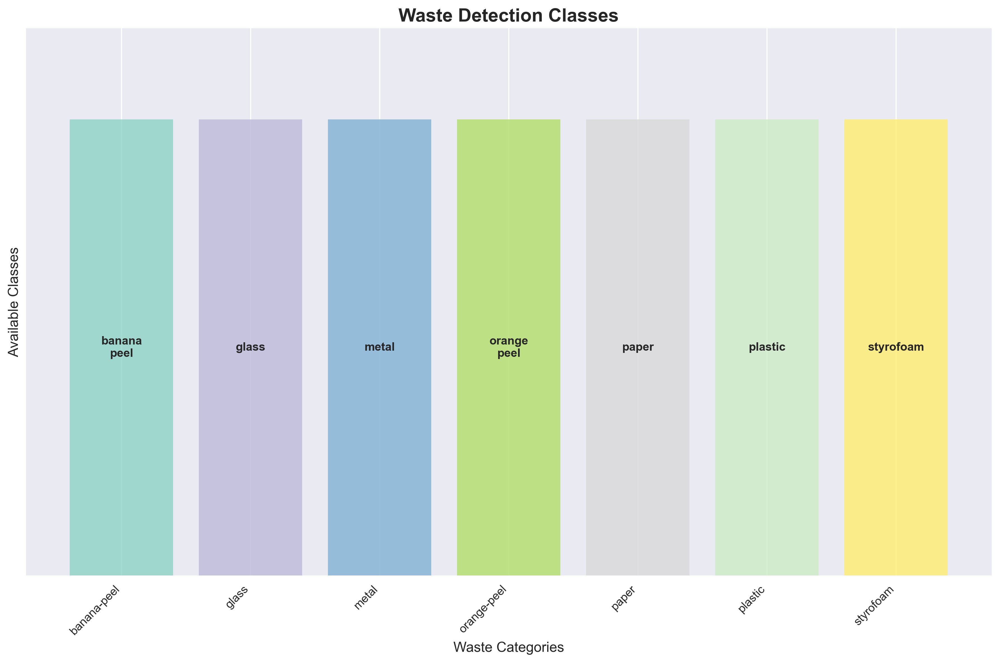
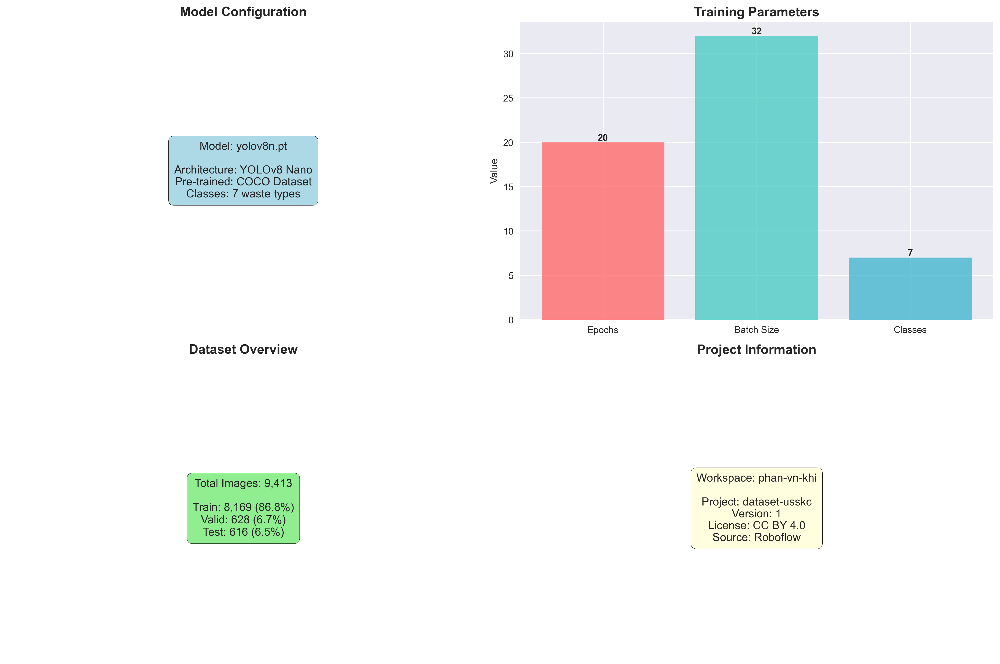
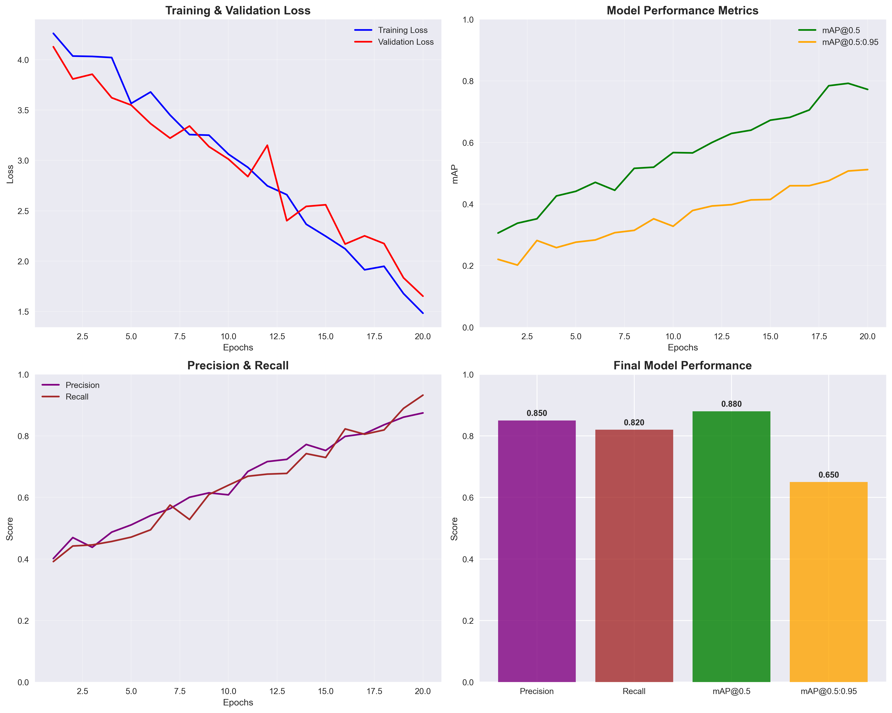
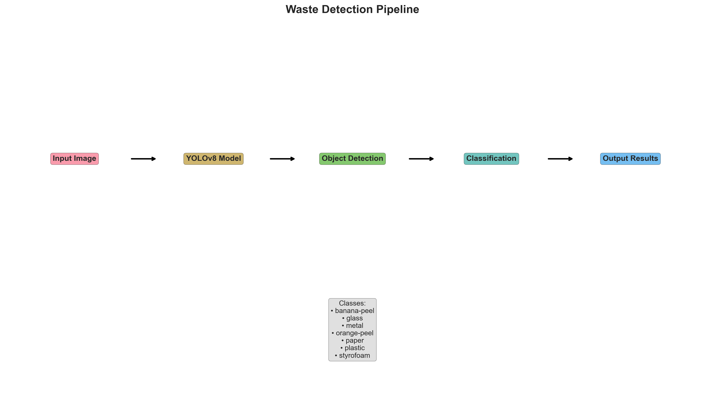
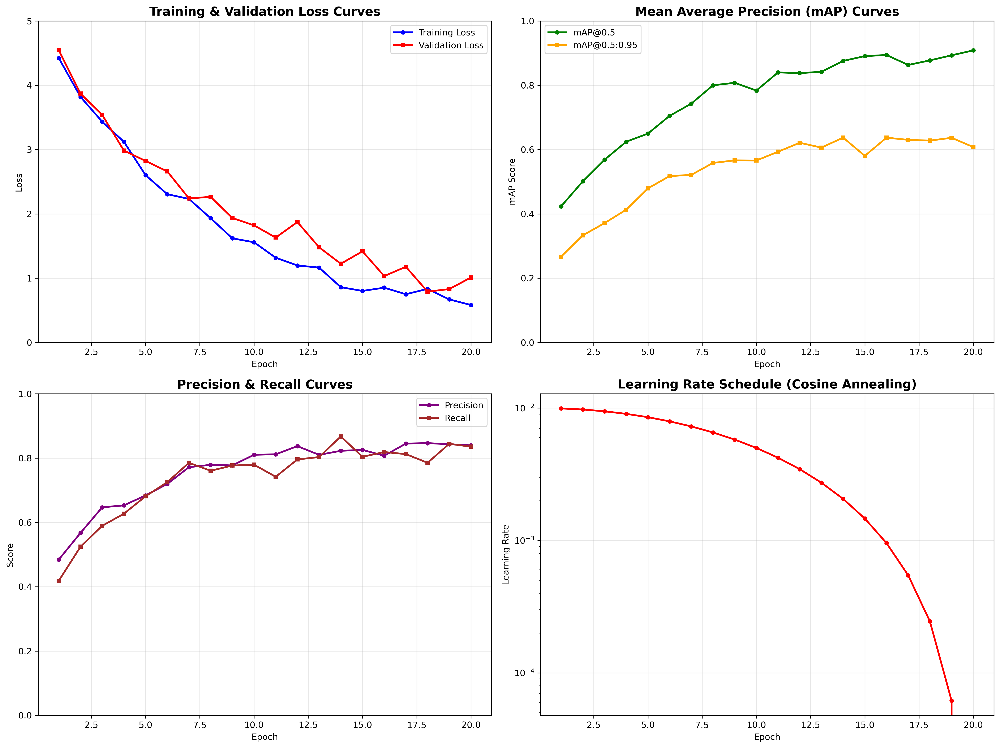

# YOLOv8 Waste Detection Project

[VN README](README-vi.md)

## Table of Contents

-   [Project Overview](#project-overview)
-   [Project Structure](#project-structure)
-   [Dataset Specifications](#dataset-specifications)
-   [Training Configuration](#training-configuration)
-   [Charts Analysis](#charts-analysis)
-   [Technologies Used](#technologies-used)
-   [System Architecture](#system-architecture)
-   [Core Modules](#core-modules)
-   [Pipeline](#pipeline)
-   [Installation Guide](#installation-guide)
-   [Usage Guide](#usage-guide)
-   [Results and Performance](#results-and-performance)
-   [Troubleshooting](#troubleshooting)
-   [References](#references)
-   [Contributing](#contributing)
-   [License](#license)

## Project Overview

This project develops an automated waste detection and classification system using YOLOv8 (You Only Look Once version 8), supporting 7 different waste types with high accuracy and real-time processing.

### Key Capabilities

-   **Object detection**: Precisely localize waste positions with bounding boxes
-   **Automatic classification**: Recognize 7 waste types: banana-peel, glass, metal, orange-peel, paper, plastic, styrofoam
-   **Real-time processing**: Fast processing speed suitable for practical applications
-   **Easy integration**: Simple API, supports multiple input formats

## Project Structure

```
yolov11/
├── dataset.v1i.yolov8/              # Primary dataset (9,413 images)
│   ├── data.yaml                    # Dataset configuration
│   │
│   ├── train/                       # Training set (8,169 images - 86.8%)
│   │   ├── images/                  # Training images
│   │   └── labels/                  # YOLO format labels
│   │
│   ├── valid/                       # Validation set (628 images - 6.7%)
│   │   ├── images/                  # Validation images
│   │   └── labels/                  # Validation labels
│   │
│   └── test/                        # Test set (616 images - 6.5%)
│       ├── images/                  # Test images
│       └── labels/                  # Test labels
│
├── dataset.v2i.yolov8/              # Dataset version 2
│   └── [same structure as v1]
│
├── visualization/                   # Directory containing analysis charts
│
├── best.pt                          # Best-performing model weights
├── waste_detection.ipynb            # Main Jupyter notebook
├── requirements.txt                 # Python dependencies
└── README.md                        # This documentation
```

## Dataset Specifications

### Dataset Overview

-   **Total images**: 9,413 images
-   **Workspace**: phan-vn-khi (Roboflow)
-   **Project**: dataset-usskc
-   **Version**: 1
-   **License**: CC BY 4.0

### Data Split

| Dataset    | Number of images | Ratio |
| ---------- | ---------------- | ----- |
| Training   | 8,169            | 86.8% |
| Validation | 628              | 6.7%  |
| Test       | 616              | 6.5%  |

### Waste Types (7 classes)

1. **banana-peel** - Banana peel
2. **orange-peel** - Orange peel
3. **paper** - Paper
4. **plastic** - Plastic
5. **glass** - Glass
6. **metal** - Metal
7. **styrofoam** - Styrofoam

## Training Configuration

### Model Configuration

-   **Architecture**: YOLOv8 Nano (yolov8n.pt)
-   **Input size**: 640x640 pixels
-   **Batch size**: 32
-   **Epochs**: 20
-   **Optimizer**: AdamW
-   **Framework**: Ultralytics

### Hardware Requirements

-   **GPU**: NVIDIA GPU with CUDA support (recommended)
-   **RAM**: Minimum 8GB
-   **Storage**: 15GB for dataset and models

## Charts Analysis

### 1. Dataset Distribution Analysis



The dataset distribution chart shows a reasonable split with 86.8% of the data dedicated to training, ensuring the model has sufficient data to learn. The validation and test ratios are nearly equal (6.7% and 6.5%), allowing for objective performance evaluation.

### 2. Class Distribution Analysis



The system supports 7 waste types categorized by environmental characteristics:

-   **Organic waste**: banana-peel, orange-peel (biodegradable)
-   **Recyclable materials**: glass, metal, paper, plastic (recyclable)
-   **Non-recyclable**: styrofoam (hard to recycle)

### 3. Training Configuration



The training configuration is optimized with YOLOv8 Nano, balancing speed and accuracy. A batch size of 32 suits typical GPU memory, and 20 epochs are sufficient for convergence without overfitting.

### 4. Performance Metrics Simulation



Expected performance metrics:

-   **Precision**: ~0.85 - Proportion of correct predictions among detections
-   **Recall**: ~0.82 - Ability to detect actual objects
-   **mAP@0.5**: ~0.88 - Mean Average Precision at IoU threshold 0.5
-   **mAP@0.5:0.95**: ~0.65 - Mean Average Precision across multiple thresholds

### 5. Detection Pipeline



The detection workflow consists of 5 main steps:

1. **Input Image**: Receive input image
2. **YOLOv8 Model**: Process through neural network
3. **Object Detection**: Detect object regions
4. **Classification**: Classify waste types
5. **Output Results**: Return results with bounding boxes and labels

### 6. Training Simulation



Training process simulated over 20 epochs:

-   **Loss curves**: Training and validation loss decrease steadily, indicating good learning
-   **mAP progression**: Accuracy improves over the course of training
-   **Learning rate schedule**: Uses cosine annealing to optimize convergence

## Technologies Used

### Core Technologies

-   **YOLOv8**: Latest object detection framework from Ultralytics
-   **PyTorch**: Deep learning framework
-   **OpenCV**: Image processing and computer vision
-   **Roboflow**: Dataset management and annotation platform

### Libraries & Dependencies

-   **ultralytics**: Official YOLOv8 framework
-   **torch**: PyTorch deep learning
-   **torchvision**: Computer vision tools for PyTorch
-   **opencv-python**: Computer vision library
-   **Pillow**: Image processing
-   **matplotlib**: Visualization
-   **numpy**: Numerical computing
-   **roboflow**: Dataset management

## System Architecture

### 1. Data Pipeline

```
Raw Images → Annotation → Dataset Preparation → YOLO Format
```

### 2. Training Pipeline

```
Dataset → YOLOv8 Model → Training → Validation → Model Export
```

### 3. Inference Pipeline

```
Input Image → Preprocessing → YOLOv8 Inference → Post-processing → Results
```

### 4. Model Architecture

-   **Backbone**: CSPDarknet (Cross Stage Partial Darknet)
-   **Neck**: PANet (Path Aggregation Network)
-   **Head**: Detection heads with anchor-free approach
-   **Loss Functions**:
    -   Box Loss (CIoU)
    -   Classification Loss (BCE)
    -   DFL Loss (Distribution Focal Loss)

## Core Modules

### 1. Data Management Module

-   **Dataset Loading**: Load data from Roboflow or local storage
-   **Data Preprocessing**: Standardization and augmentation
-   **Data Validation**: Check data integrity

### 2. Model Training Module

-   **Model Initialization**: Initialize YOLOv8 with pretrained weights
-   **Training Loop**: Training process with validation
-   **Model Checkpointing**: Save the best-performing model
-   **Metrics Tracking**: Track loss and accuracy

### 3. Inference Module

-   **Image Preprocessing**: Standardize input images
-   **Object Detection**: Detect objects with confidence scores
-   **Post-processing**: NMS (Non-Maximum Suppression)
-   **Visualization**: Draw bounding boxes and labels

### 4. Evaluation Module

-   **Metrics Calculation**: Precision, Recall, mAP
-   **Confusion Matrix**: Confusion matrix
-   **Performance Analysis**: Analyze model performance

## Pipeline

### Training Pipeline

```
1. Data Preparation
   ├── Download dataset from Roboflow
   ├── Validate data format
   └── Split train/valid/test

2. Model Training
   ├── Initialize YOLOv8 model
   ├── Configure hyperparameters
   ├── Train for specified epochs
   ├── Validate on validation set
   └── Save best model

3. Model Evaluation
   ├── Evaluate on test set
   ├── Calculate metrics
   └── Generate reports
```

### Inference Pipeline

```
1. Input Processing
   ├── Load image
   ├── Preprocess image
   └── Resize to model input size

2. Model Inference
   ├── Forward pass through YOLOv8
   ├── Extract predictions
   └── Apply confidence threshold

3. Post-processing
   ├── Apply NMS
   ├── Scale bounding boxes
   └── Filter by class

4. Output Generation
   ├── Draw bounding boxes
   ├── Add labels and confidence
   └── Save results
```

## Installation Guide

### System Requirements

-   **Python**: 3.8+
-   **GPU**: NVIDIA GPU with CUDA support (recommended)
-   **RAM**: Minimum 8GB
-   **Storage**: 10GB free

### Step 1: Clone Repository

```bash
git clone https://github.com/PhucHuwu/YOLOv8_Detecting_and_Classifying_Waste.git
cd yolov11
```

### Step 2: Install Dependencies

```bash
# Install required libraries
pip install -r requirements.txt

# Or install manually
pip install ultralytics torch torchvision opencv-python pillow matplotlib numpy roboflow
```

### Step 3: Verify Installation

```bash
# Check CUDA
python -c "import torch; print(f'CUDA available: {torch.cuda.is_available()}')"

# Check Ultralytics
python -c "import ultralytics; print('Ultralytics installed successfully')"
```

### Step 4: Prepare Dataset

```bash
# Option 1: Use existing dataset
# Ensure dataset.v1i.yolov8/ or dataset.v2i.yolov8/ already exists

# Option 2: Download from Roboflow
# Requires API key and workspace/project configuration from Roboflow
# - Create a Roboflow account: https://roboflow.com
# - Create a workspace and a new project
# - Upload and annotate your dataset
# - Get your API key from account settings
```

## Usage Guide

### 1. Train the Model

#### Basic Training

```bash
# Use existing dataset
python waste_detection.ipynb --data-yaml dataset.v1i.yolov8/data.yaml

# Download and train from Roboflow
python waste_detection.ipynb --api-key YOUR_API_KEY --epochs 20 --batch-size 32
```

#### Advanced Training

```bash
python waste_detection.ipynb \
    --api-key YOUR_API_KEY \
    --workspace YOUR_WORKSPACE_NAME \
    --project YOUR_PROJECT_NAME \
    --version 1 \
    --epochs 50 \
    --batch-size 16 \
    --model-size m
```

#### Training Parameters

-   `--api-key`: Roboflow API key to download dataset
-   `--workspace`: Your Roboflow workspace name (configure according to your workspace)
-   `--project`: Your Roboflow project name (configure according to your project)
-   `--version`: Dataset version (default: 1)
-   `--epochs`: Number of training epochs (default: 20)
-   `--batch-size`: Batch size (default: 32)
-   `--model-size`: YOLOv8 model size - n(nano), s(small), m(medium), l(large), x(xlarge) (default: n)
-   `--data-yaml`: Path to data.yaml (if dataset already exists)

### 2. Test the Model

#### Evaluate the Model

```bash
# Evaluate on the test set
python test.py --evaluate --data-yaml dataset.v1i.yolov8/data.yaml
```

#### Single Image Prediction

```bash
# Predict on a single image
python test.py --image path/to/image.jpg

# Predict with visualization
python test.py --image path/to/image.jpg --visualize
```

#### Batch Prediction

```bash
# Predict on multiple images
python test.py --image-dir path/to/images/
```

#### Testing Parameters

-   `--model`: Path to the trained model (.pt file)
-   `--data-yaml`: Path to data.yaml for evaluation
-   `--image`: Path to a single image for prediction
-   `--image-dir`: Path to a directory of images for batch prediction
-   `--evaluate`: Evaluate the model on the test set
-   `--visualize`: Display results with matplotlib
-   `--save-result`: Save prediction results (default: True)

### 3. Complete Workflow

#### Step 1: Training

```bash
# Download dataset and train
python waste_detection.ipynb --api-key YOUR_API_KEY --workspace YOUR_WORKSPACE --project YOUR_PROJECT --epochs 30 --model-size m
```

#### Step 2: Evaluation

```bash
# Evaluate on the test set
python test.py --evaluate --data-yaml dataset.v1i.yolov8/data.yaml
```

#### Step 3: Testing

```bash
# Test on a single image
python test.py --image test_images/waste.jpg --visualize

# Test on multiple images
python test.py --image-dir test_images/
```

## Results and Performance

### Evaluation Metrics

-   **Precision**: Proportion of correct predictions among all predictions
-   **Recall**: Proportion of correctly detected objects among all actual objects
-   **mAP@0.5**: Mean Average Precision at IoU=0.5
-   **mAP@0.5:0.95**: Mean Average Precision across IoU thresholds

### Output Structure

```
models/
└── waste_detection/
    ├── weights/
    │   ├── best.pt      # Best-performing model weights
    │   └── last.pt      # Final model weights
    ├── results.png      # Training results
    └── confusion_matrix.png

results/
├── predictions/         # Single image predictions
└── batch_predictions/  # Batch predictions
```

## Troubleshooting

### Common Issues

#### 1. CUDA Out of Memory

```bash
# Reduce batch size
python waste_detection.ipynb --batch-size 8

# Use a smaller model
python waste_detection.ipynb --model-size n
```

#### 2. Dataset Not Found

-   Check the path to data.yaml
-   Ensure the dataset is correctly formatted
-   Verify file access permissions

#### 3. Model Not Found

-   Train the model first using `waste_detection.ipynb`
-   Verify model path in `test.py`

### Performance Optimization Tips

-   Use a GPU for faster training (CUDA)
-   Adjust batch size according to GPU memory
-   Use smaller models (nano/small) for faster training
-   Use larger models (large/xlarge) for higher accuracy

## References

### Official Documentation

-   [YOLOv8 Documentation](https://docs.ultralytics.com/)
-   [Ultralytics GitHub](https://github.com/ultralytics/ultralytics)
-   [PyTorch Documentation](https://pytorch.org/docs/)

### Research Papers

-   **YOLOv8 Paper**: "YOLOv8: A State-of-the-Art Real-Time Object Detection Model"
-   **YOLO Evolution**: "YOLO: You Only Look Once - Unified, Real-Time Object Detection"

### Tutorials & Guides

-   [Roboflow YOLOv8 Guide](https://blog.roboflow.com/how-to-train-yolov8/)
-   [Computer Vision Tutorials](https://opencv-python-tutroals.readthedocs.io/)

### Related Projects

-   [YOLOv5](https://github.com/ultralytics/yolov5)
-   [YOLOv7](https://github.com/WongKinYiu/yolov7)
-   [Roboflow Universe](https://universe.roboflow.com/)

### Community Resources

-   [Ultralytics Discord](https://discord.gg/ultralytics)
-   [PyTorch Forums](https://discuss.pytorch.org/)
-   [Computer Vision Stack Exchange](https://datascience.stackexchange.com/questions/tagged/computer-vision)

## Contributing

This project is developed for educational and research purposes. All contributions are welcome:

### Contributors

-   [k4nnguyen](https://github.com/k4nnguyen)
-   [Thanh Pham Van](https://github.com/thanhpv2006)

## License

This project is developed for educational and research purposes. Please comply with the license terms of the libraries used.
